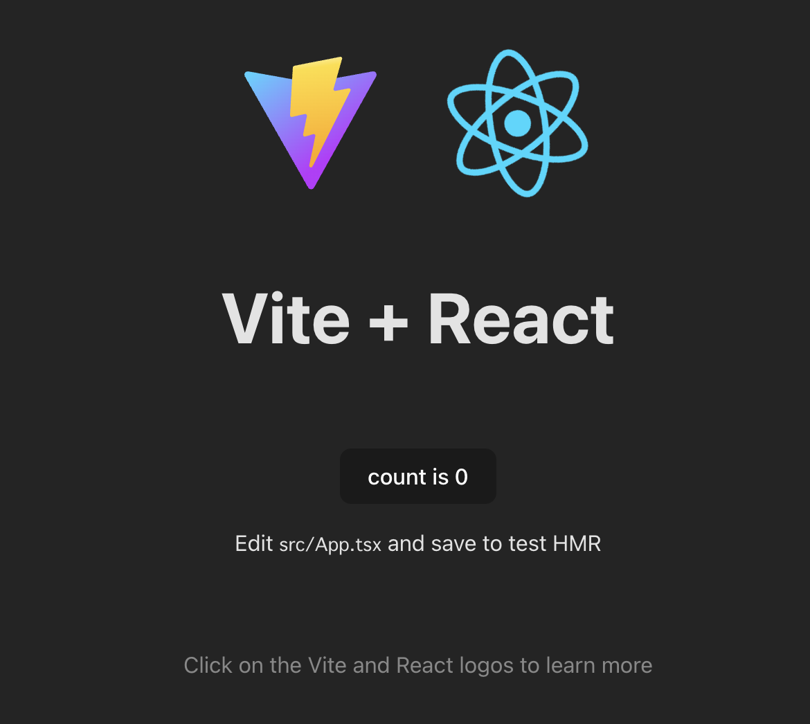
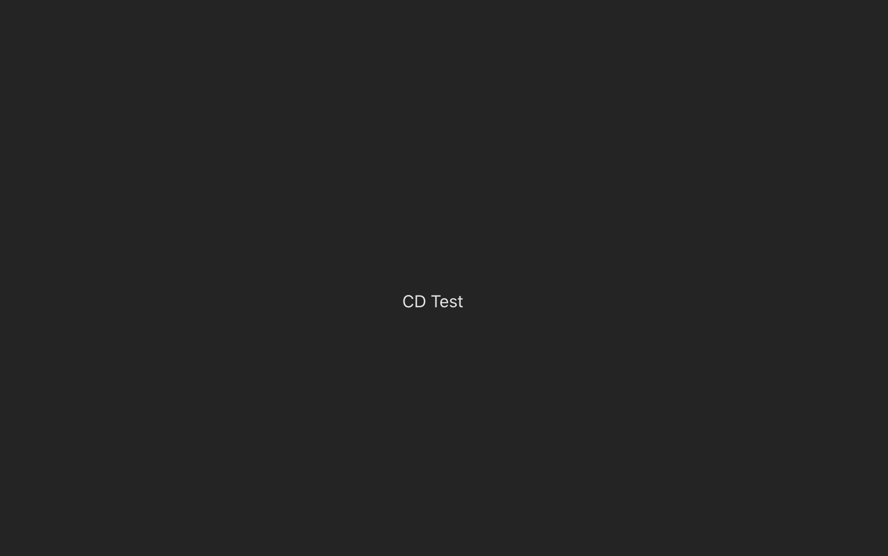
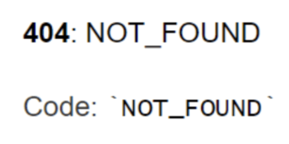
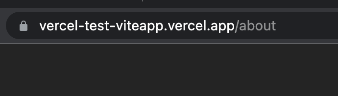

### vercel のテスト用リポジトリ

**プロジェクトの作成**

- docker-compose の次の部分をコメントアウト

```
    command: sh -c "npm install & npm run dev"
```

- コンテナの立ち上げ

```
    docker compose up -d
```

- React (TypeScript)プロジェクトの作成

```
    docker compose exec react npm create vite@latest
```

- vite.config.ts ファイルの編集

```
    export default defineConfig({
        plugins: [react()],
        server: {
            host: true,
        },
    });
```

- コメントアウト部分を戻してコンテナを立ち上げ直す

```
    docker compose down
    docker compose up -d
```

- http://localhost:5173 にアクセスし，Vite の初期ページが表示されることを確認



### CDのテスト
- masterの変更は即反映される



- devの変更はmasterにマージしないと反映されない (masterをデプロイしている)

- react-routerが上手く機能していない



- app/に`vercel.json`を追加したらうまくいった
```
    {
        "rewrites": [{ "source": "/(.*)", "destination": "/" }]
    }
```


